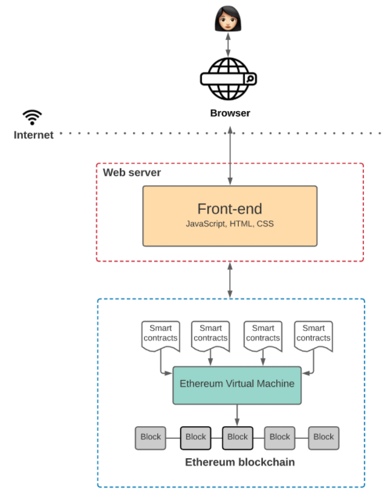
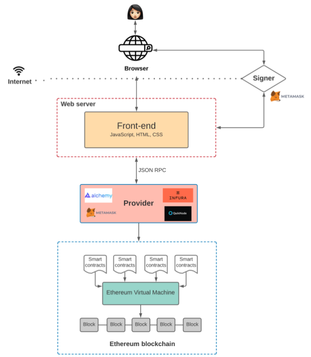
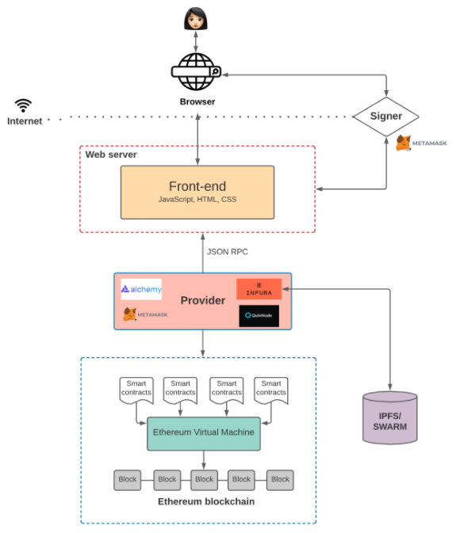
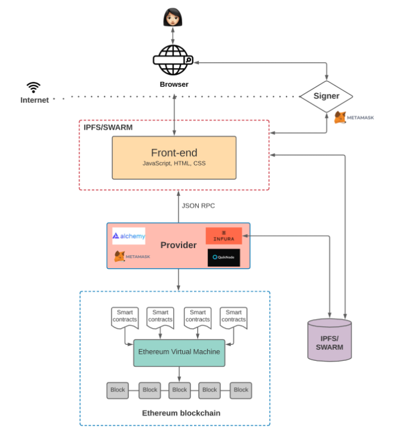
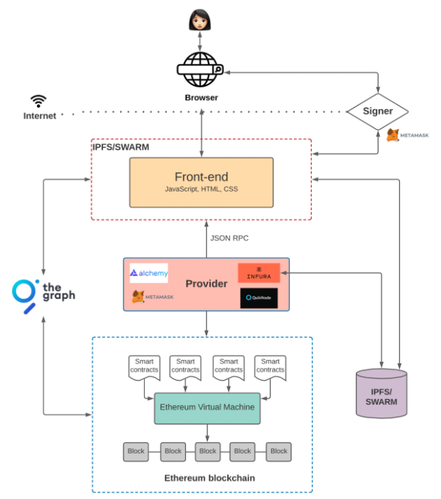
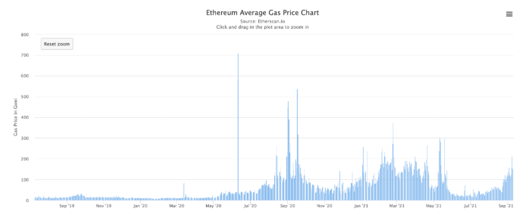
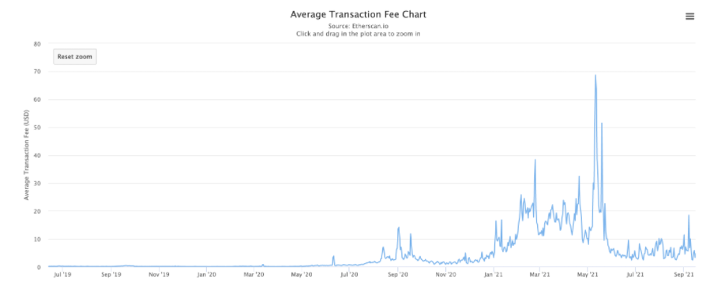
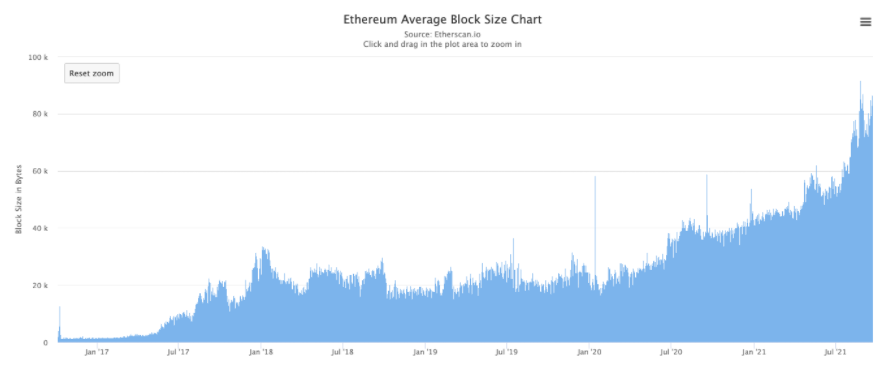
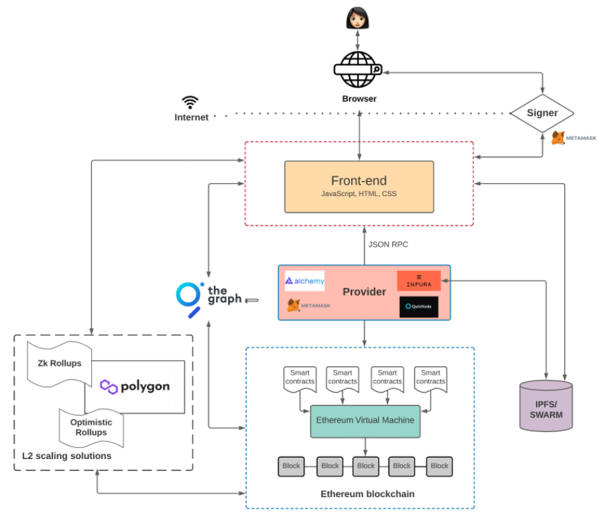

应用架构中的每一个组件都决定着应用的底层属性

大家对于区块链、智能合约、IPFS、钱包、节点等这些名词都不陌生，也大概明白他们都是做什么的，然而他们是如何联动起来服务于 Web3.0 去中心化应用的搭建的呢？

展现在我们眼前的仅仅是应用的前端，我们很难窥探到应用背后究竟是如何实现的。应用架构中的每一个组件都决定着应用的底层属性，若想真的理解 Web2.0 与 Web3.0 应用之间的本质差异，我们需要从应用的架构入手。

### **Web 3.0 的应用架构**

Web 3.0 应用程序（或"DApps"）的架构与 Web 2.0 应用程序完全不同。

以 Medium，一个简单的博客网站为例子。Medium 允许用户发布自己的内容并与其他人的内容进行交互。

Medium 是一个 web 2.0 应用程序，架构听起来很简单。但实际上在 Medium 的架构中，需要大量工作使这一切成为可能。

首先，Medium 需要一个地方来存储像用户，帖子，标签，评论，赞之类的基础数据。这些工作需要不断地更新数据库。

其次，像 Node.js, Java, or Python 后端代码语言决定了 medium 的商业逻辑。例如，当新用户注册、发布新博客或在他人博客上发表评论时会发生什么情况？

还有，像 JavaScript, HTML, and CSS 之类的前端代码语言决定了 Medium 的 UI 逻辑。例如，网站是什么样子的，当用户与页面上的每个元素交互时会发生什么？

当你在 Medium 上写博客时，这些所有的东西会整合起来联动。你与它的前端互动，前端和后端交互，后端再与它的数据库交互。所有这些代码都托管在中心化服务器上，并通过互联网浏览器发送给用户。这是对当今大多数 Web 2.0 应用程序的工作原理的一个高度总结。

现在这些全变了。

区块链技术为 Web 3.0 应用开启了令人兴奋的新方向。在本文中，我们将重点讨论以太坊带来的改变。

### **是什么让 Web 3.0 如此不同？**

与 Medium 这类 web2.0 程序不同是，Web3.0 去除了中间层。这中间没有存储应用程序状态的中心化数据库，也没有中心化网站服务器用于存储后端逻辑。

你可以利用区块链构建程序在去中心化的状态机构建应用程序，这一系统是由互联网上的匿名节点在维护。

状态机是指一种可维持程序状态并允许新的状态写入的「机器」。区块链就是一种虚拟机，其以创世状态作为示例，随后状态根据具体规则进行转换。

更重要的是，没有单一实体控制这个去中心化的状态机，它由网络中的每个人共同维护。

在 Web 3.0 中，你可以编写智能合约来定义应用程序的逻辑并将它们部署到去中心化的状态机上。这意味着每个想要构建区块链应用程序的人都在这个共享状态机上部署他们的代码。这与 Medium 的后端十分不同。

Web3.0 的前端和 Web2.0 的前端基本相同，有一些特例我们将在后文中讲解。

下图是 Web3.0 的架构

### **深度解析**

那么，让我们更深入地了解是什么让这一切成为可能

1）区块链

以太坊是全球都可以参与维护的，点对点具有确定性的状态机，这让以太坊经常被吹捧为「世界电脑」。状态机上的状态更改由网络中的遵循共识规则的节点控制。

换句话说，它实际上被设计为世界上任何人都可以访问和写入的状态机。因此，这台机器不属于任何单一实体，而是由网络中的每个人共同拥有。

还有一件事要知道：数据只能写入以太坊区块链，你永远无法更新现有数据。

2）智能合约

智能合约是运行在以太坊区块链上的程序，用于定义区块链上发生的状态变化背后的逻辑。智能合约通常都用 Solidity 或者 Vyper 这类的高级语言编写。

由于智能合约代码存储在以太坊区块链上，任何人都可以检查网络上所有智能合约的应用逻辑。

3）以太坊虚拟机（EVM）

虚拟机是用来执行智能合约中定义的逻辑并处理状态机上发生的状态变化。

以太坊虚拟机不理解像 Solidity 或 Vyper 的这种高阶语言。你需要将这些高阶语言编译成以太坊虚拟机可以执行的字节码。

4）前端

正如我们之前提到的，前端定义了 UI 逻辑，但前端也与智能合约中定义的应用程序逻辑进行交互。

前端和智能合约之间的交互比上图中显示的要复杂一些。接下来让我们详细说明一下这部分。

### **以太坊上前端代码如何与智能合约进行交互**

我们想让前端和智能合约交互时能够触发程序的特定功能，但不要忘记，以太坊是一个去中心化的网络。所有每一个以太坊的节点都需要保存一份以太坊状态机上所有状态的副本。这个副本包括所有与智能合约相关的代码和数据。

当我们想和区块链上的数据和代码进行交互的时候，我们要和区块链中的某一节点进行通信。因为任何节点都可以广播在以太坊虚拟机上进行交易的请求。在这之后矿工将执行交易并将结果状态更改广播到网络的其他节点上。

有两种方式广播新的交易：

1． 自己设立一个运行以太坊程序的节点

2． 使用 [Infura](https://link.zhihu.com/?target=https%3A//infura.io/) 或者 [Alchemy](https://link.zhihu.com/?target=https%3A//www.alchemy.com/) 第三方提供的节点

使用第三方节点，能让你免去自己运行全节点所带来的麻烦。因为有大量数据需要同步的关系，设立一个以太坊的节点通常需要好几天的时间。并且同步所需的带宽和存储容量超过了一般笔记本电脑的处理能力，所以你同时需要一台性能强劲的设备。

此外，存储完整以太坊区块链的成本随着 DApp 的扩容而增加，你需要添加更多节点来扩张你的基础设施。当你的基础设施变得复杂到一定程度后，你将需要一个全职 DevOps 工程师（可编程运维工程师）。他们将帮助你维护基础设施，以确保你的基础设施有着可靠的正常运行时间和快速的响应时间。

综上所述，为了避免这些麻烦，许多 DApp 选择使用 Infura 或 Alchemy 之类的服务商来管理他们的节点。但凡事有利有弊，这也造成了一个中心化的阻塞点。但我们先不谈这个问题。

不管是你自己设置还是使用来自第三方服务的节点，这些节点通常被称为「提供商」（Providers）。我们接下来好好说说这些「提供商」。

每个以太坊客户端（提供者）实行 JSON-RPC 规范。这确保了前端应用程序想要与区块链交互时有一组统一的方法。JSON-RPC 是一种无状态、轻量级的远程应用程式调用 (RPC) 协议，它定义了多个数据结构及其处理规则。因为它具有传输不可知性（transport-agnostic），因此这些概念可在同一进程中被使用、穿梭在 sockets、 HTTP 或许多不同的消息传递环境中。它使用 JSON (RFC 4627) 作为数据格式。

当你通过提供商连接到区块链后，你就可以读取存储在区块链上的状态。但是，如果你想写入状态，你需要在将交易提交到区块链之前，使用你的私钥对交易进行「签名」。

举个例子，假设我们运行了一个 DApp，它可以让用户阅读或发布博客文章到区块链。你在前端设置了一个按钮，允许任何人查询特定用户撰写的博客文章。但要记得，阅读区块链中的文章并不需要用户对交易进行签名。

但是，当用户想要在区块链上发布新的文章时，DApp 会要求用户使用他们的私钥「签署」交易，只有这样 DApp 才会将交易传播到区块链上。否则节点不会接受这笔交易。

签署交易这个环节通常是需要使用 [Metamask（小狐狸）](https://link.zhihu.com/?target=https%3A//metamask.io/)的时候。

Metamask 是一种工具，可让应用程序轻松处理密钥管理和交易签名。它原理非常简单，Metamask 将用户的私钥存储在浏览器中，每当前端需要用户签署交易时，它都会调用 Metamask。

Metamask 也会作为提供商与区块链进行链接。因为 Metamask 需要签署交易，所以它与 Infura 提供的节点建立了连接。在某种程度上说，Metamask 既是提供者又是签名者。

### **在区块链上存储**

当然，如果你所搭建的应用中所有智能合约和数据都存储在以太坊上的话，那么这种架构还算合理。然而，在以太坊上搭建过应用程序的人都知道，在区块链上存储虽然快捷，但价格也不菲。

我们要明白，用户每次在以太坊上添加新数据都要付费。这是因为去中心化的状态机是由节点来维护的，而在状态机上每新增一个状态，都会增加节点的成本。

如果你的 DApp 每次在用户交易需要添加新状态时，都要求他们支付额外费用的话，那么用户体验是很差的。不过，使用去中心化链下存储方案，如 IPFS 或 Swarm，便可以解决这一问题。

IPFS 是一个用于存储与访问数据的分布式文件系统。也就是说，IPFS 系统并不是将数据存储在一个中心化的数据库中，而是将数据分布式存储在 P2P 网络中，让你随时可以对数据进行检索。

「Filecoin」是 IPFS 的激励层，其作用是激励世界各地的节点来存储和检索这些数据。你可以使用像 Infura 或 Pinata 这样的提供商，因为 Infura 可以为你提供 IPFS 节点，而 Pinata 则可以让你将文件在 IPFS 中「定位」，继而得到 IPFS 的哈希值并将其存储在区块链上，且整个操作过程相当简单。

Swarm 是一个去中心化的存储网络，和 IPFS 有很多相似之处，但二者也有一个明显区别。那就是，Filecoin 系统相对独立，Swarm 的激励系统是内置的，由以太坊上的智能合约来执行，用于数据的存储与检索。

所以现在，有了 IPFS 或 Swarm，我们的应用架构会是这样的：

在下图当中，机智的你可能会注意到，前端代码并没有存储在区块链上。其实我们完全可以和我们在 Web 2.0 中所做的一样，将代码存储在 AWS 上面，但这样做也意味着你的 DApp 会受到来自中心化的制约。比方说，如果 AWS 瘫痪了怎么办？如果它对你的应用程序进行审查又该怎么办？

这也就是为什么，如果你想搭建一个真正的去中心化应用程序，你会选择像 IPFS 或 Swarm 这样的去中心化存储方案来储存前端了。

所以现在你的应用架构会变成这样：

### **在区块链上进行查询**

到目前为止，我们已经探讨了如何通过签署交易并将它们发送到区块链上来完成交易的写入。但从区块链上的智能合约中读取数据又该如何操作呢？主要有以下两种方式：

1）智能合约事件

你可以利用 ethers.js 库来查询和监听智能合约事件。你也可以使用 ethers.js 监听特定事件，并指定一个回调函数在每次事件触发时进行调用。比如说，现在假设有一个智能合约可以在每个区块中的发送者与接收者之间发送连续支付流，那么每次向接收者支付款项时，你都可以发出一个智能合约事件。前端代码可以监听由智能合约所触发的事件，并据此采取相应行动。

2）The Graph

上述方法的确可行，但它同时也有一定的不足。比如说，你可能在智能合约部署完成后才发现，自己要发送的事件并没有包含在合约当中，这该如何是好？不幸的是，你只能重新部署一个新的智能合约，并将该事件与相关数据放入新的合约当中。不仅如此，回调函数也很难处理不同的 UI 逻辑。

这时就该让「The Graph」上场了。

The Graph 是一个链下数据索引方案，可以方便人们在以太坊上查询数据。在 The Graph 中，你既可以定义哪些智能合约需要索引、哪些事件与函数调用需要监听，也可以规定如何将传入的事件转化为前端逻辑（或任何正使用 API 的程序）可处理的实体。它使用 GraphQL 作为查询语言，这种语言深受前端工程师的喜爱，因为与传统的 REST API 相比，它能传达更多信息。

通过索引区块链数据，The Graph 可以让我们在应用逻辑中查询链上数据，并且几乎不会出现延迟的情况。

现在，你的 DApp 架构大概是这样：

现在只剩下最后一个重要问题：扩容。

### **DApp 的扩容**

你可能已经听说了，以太坊不具备可扩展性，至少目前还没有。

_以太坊 Gas 平均价格_

_平均交易费用_

_平均区块规模_

显然，问题在于，以太坊上 Gas 费用高昂且区块几近饱和，在它上面搭建 DApp 会给用户带来非常不好的体验。不过值得庆幸的是，一些相关方案正在开发当中。

Polygon 便是一个很受欢迎的 L2 扩容方案。在 Polygon 中，交易的处理与执行是由「侧链」而非主链来完成的。这些侧链是与主链相连的二级区块链。每隔一段时间，侧链就会将其最近的区块聚合起来提交给主链。

同样，Optimistic Rollup 和 zkRollup 也属于 L2 方案，工作原理也都类似：他们用「Rollup」智能合约在链下将大量交易进行捆绑，然后定期将这些交易提交给主链。

我们需要知道的是：L2 方案是将交易的执行（即速度较慢的部分）放在链下进行，而在链上只储存交易数据。这样一来，区块链就能得以扩容，因为我们不用再在链上执行每笔交易了。同时，这也让交易进程加快、成本降低，而且在必要时，L2 方案还可以与以太坊主链进行通信。

### **全貌**

如果到此你感觉头晕目眩、迷惑不解，也属于正常现象，因为将所有这些工具整合在一起本来就十分复杂，容易让开发者感到焦头烂额。但是不用担心，开发框架的不断问世将会切实提升开发者的工作体验。

比如说，Hardhat 就是一个能方便以太坊开发者搭建、部署并测试智能合约的开发框架。Hardhat 内置了「Hardhat 网络」，开发者可以用此网络将智能合约部署到本地网络上，而无需处理实时环境。不仅如此，它还搭载了一个强大的插件生态系统，可以为开发者提供更大的便利。同时，Hardhat 还具备 console.log() 功能，和 javascript 一样可以用于调试。
