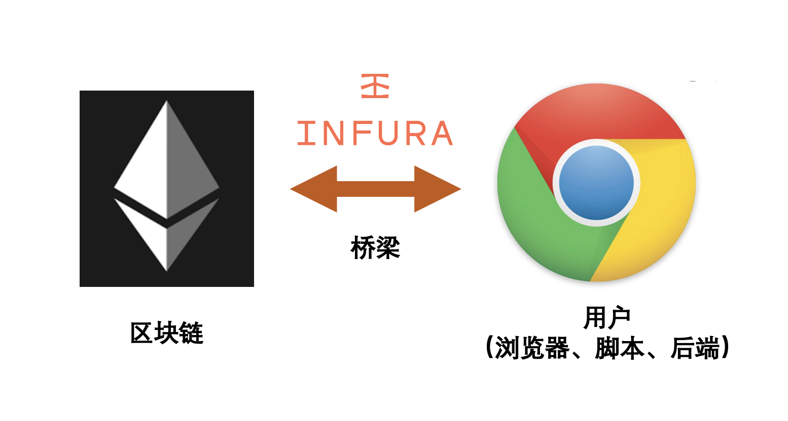
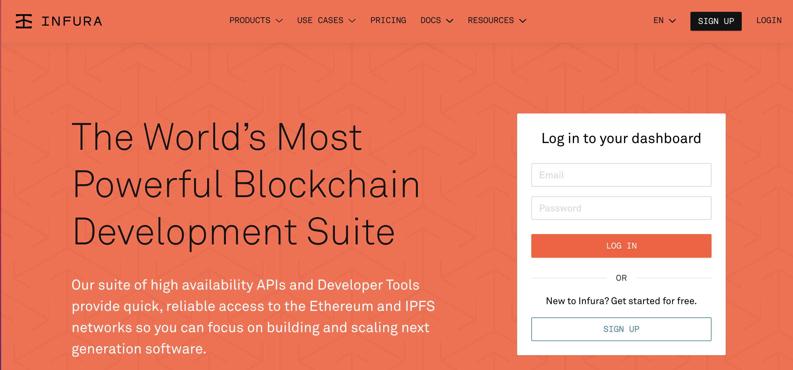
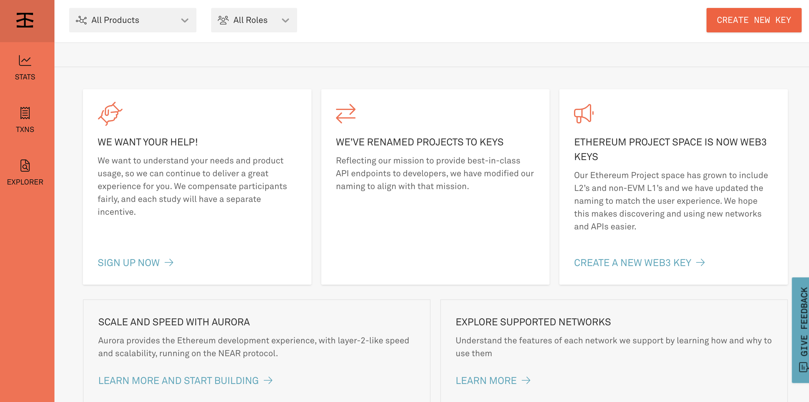
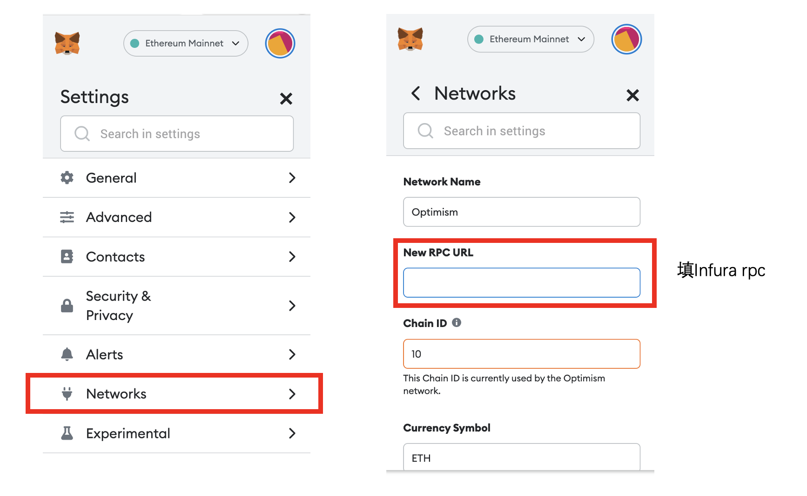

# **Infura, 连接链下与链上的桥梁**

`Infura` 是 Consensys(小狐狸钱包母公司)开发的区块链基础设施，帮助用户/开发者更好的与以太坊区块链交互。

## **连接应用和区块链**



在以太坊上开发的 Dapp 应用（链下）需要与区块链（链上）交互。早期，以太坊上的基础设施很少，开发者需要在本地部署以太坊节点来完成链下和链上的交互，非常麻烦，且耗时数日。

`Infura` 在链下、链上之间搭了一座桥，让两者的交互变的简单。它为用户提供对以太坊和 IPFS 网络的即时、可扩展的 `API` 访问。开发者在 `Infura` 官网注册后，就可以免费申请的以太坊 `API KEY`，就可以利用 `Infura` 的节点与区块链交互。另外，小狐狸 `metamask` 钱包内置了 `Infura` 服务，方便用户访问以太坊网络。

## **创建Infura API Key**

1. **打开 Infura 官网并注册**

网址：<u>infura.io</u>



2. **创建 API Key**

注册后，进入控制台 Dashboard，并点击右上角的 **CREATE NEW KEY** 按钮。



3. **填写 API Key 信息**

`NETWORK` 选择 **Web3 API (Formerly Ethereum)**，有的版本这里显示的是 **Ethereum**，`NAME` 随便填一个，我填的 `RCC`，之后点击 **CREATE** 按钮。

4. **API Key 创建完毕**

回到控制台 Dashboard，可以看到名为 `RCC` 的 API Key 已经创建完毕。在控制台 Dashboard，点击 **MANAGE KEY** 按钮，可以查看 API Key 详情。

5. **查看 API Key 详情**

进入 API Key 详情页，我们可以看到我们的 API Key（图中 `184d` 开头的一组密钥）。在下面的 **NETWORK ENDPOINT** 栏中，可以查到以太网主网/测试网的 rpc 节点链接，用于访问链上数据并交互。另外，你可以申请免费的 Layer2 rpc 节点，包括 `Polygon`，`Optimism` 和 `Arbitrum`，但是需要绑定 `visa` 卡。领 `Optimism` 空投那次，公开 rpc 节点卡爆了，而使用 `Infura` 的私人 rpc 节点的人可以正常领取。

## **使用Infura API Key**

### **Javascript (****ethers.js****)**

在 `ether.js` 中，我们可以利用 `Infura` API Key 来创建 `JsonRpcProvider`，与链上交互。

```javascript
const { ethers } = require("ethers");
// 填上你的Infura API Key
const INFURA_ID = '' 
const provider = new ethers.providers.JsonRpcProvider(`https://mainnet.infura.io/v3/${INFURA_ID}`)
```

### **Metamask 小狐狸钱包**

进入小狐狸钱包设置 **Setting** 页面，点击网络 **Network**，点击添加网络 **Add Network**。你可以利用下面的参数在小狐狸中添加 `Optimism` Layer2 链：

```
网络名称（Network Name）: Optimism
RPC URL：填在Infura申请的optimism rpc链接
链ID (Chain ID): 10
符号 (Chain Symbol): ETH
区块链浏览器URL (Blockchain Explorer URL): https://optimistic.etherscan.io
```



## **总结**

这一讲，我们介绍了如何创建并使用 `Infura` API Key 便捷访问以太坊区块链。
