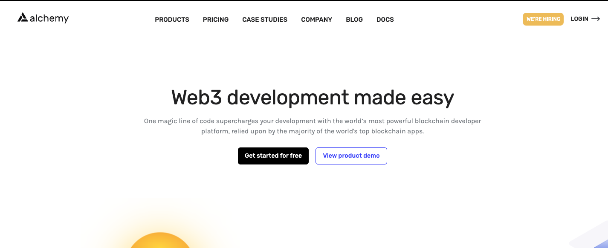

## **Alchemy 是什么**

`Alchemy` 超级节点是 Ethereum、Polygon、Solana、Arbitrum、Optimism、Flow 和 Crypto.org 使用最广泛的区块链 API。获得节点的所有功能，包括 JSON-RPC 支持，但具有在区块链上运行世界级应用程序所需的超强可靠性、数据准确性和可扩展性。

## **连接应用和区块链**

在以太坊上开发的 Dapp 应用（链下）需要与区块链（链上）交互。早期，以太坊上的基础设施很少，开发者需要在本地部署以太坊节点来完成链下和链上的交互，非常麻烦，且耗时数日。

`Alchemy` 和 `Infura` 在链下、链上之间搭了一座桥，让两者的交互变的简单。它为用户提供对以太坊和 IPFS 网络的即时、可扩展的 `API` 访问。开发者在 `Alchemy` 和 `Infura` 官网注册后，就可以免费申请的以太坊 `API KEY`，就可以利用它们的节点与区块链交互。另外，小狐狸 `metamask` 钱包内置了 `Infura` 服务，方便用户访问以太坊网络。

## **Alchemy 和 Infura 的区别**

左边是 `alchemy` 右边是 `Infura`，我们来对比下免费的套餐


### **访问量的区别**

`Alchemy` 每天没有访问限制，`Infura` 每天有 100,000 的访问限制。

`Alchemy` 每个月有 `300,000,000` 的访问量，`Infura` 每个月有 `3,000,000` 的访问量。

### **支持公链的区别（免费版本）**


`Alchemy` 支持：ETH、Polygon、Solana、Arbitrum、Optimism

`Infura` 支持：ETH、ETH2、IPFS、Filecoin

### **Alchemy 支持 enhanced-apis**


Alchemy 自己封装了一些 web3 的 api，大家可以自己看文档获取更多的细节。

<u>Alchemy - enhanced-apis</u>

## **创建Alchemy API Key**

1. **打开 Alchemy 官网并注册**

网址：<u>alchemy.com</u>



2. **创建 API Key**

- 注册后，进入控制台 Dashboard，并点击右上角的 **CREATE APP** 按钮。


3. **填写 API Key 信息**

`CHAIN`：选择你需要的网络，如果是以太网就是 `Ethereum`。

`NETWORK`:并选择是主网还是测试网。

填写完成之后点击 `CREATE APP` 即可创建。

4. **API Key 创建完毕**

回到控制台 Dashboard，可以看到 API Key 已经创建完毕。在控制台 Dashboard，点击 **view key** 按钮，可以查看 API Key 详情。

5. **查看 API Key 详情**

可以看到我们创建好了相应的 api key，最常用的 https 和 websockets 都支持。


## **使用Alchemy API Key**

### **Javascript (****ethers.js****)**

在 `ether.js` 中，我们可以利用 `Alchemy` API Key 来创建 `JsonRpcProvider`，与链上交互。

```javascript
const { ethers } = require("ethers");
// 填上你的Alchemy API Key
const ALCHEMY_ID = '' 
const provider = new ethers.providers.JsonRpcProvider(`https://eth-mainnet.g.alchemy.com/v2/${ALCHEMY_ID}`)
```

这一讲，我们介绍了如何创建并使用 `Alchemy` API Key 便捷访问以太坊区块链。
