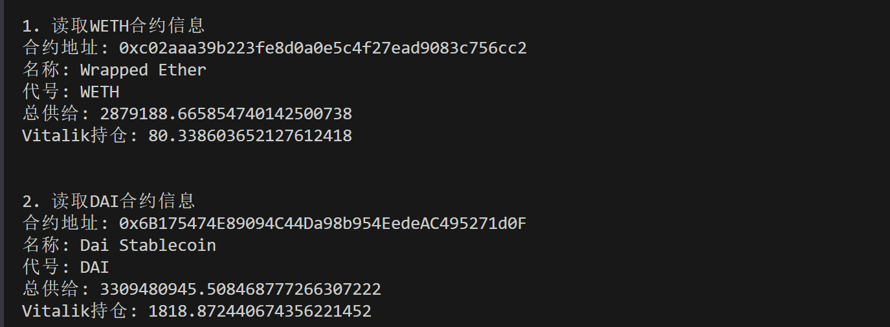
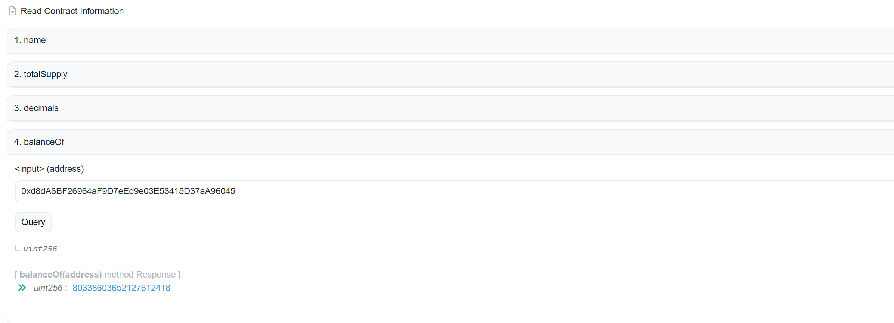

这一讲，我们将介绍 `Contract` 合约类，并利用它来读取链上的合约信息。

## **Contract类**

在 `ethers` 中，`Contract` 类是部署在以太坊网络上的合约（`EVM` 字节码）的抽象。通过它，开发者可以非常容易的对合约进行读取 `call` 和交易 `transaction`，并可以获得交易的结果和事件。以太坊强大的地方正是合约，所以对于合约的操作要熟练掌握。

## **创建****Contract****变量**

### **只读和可读写Contract**

`Contract` 对象分为两类，只读和可读写。只读 `Contract` 只能读取链上合约信息，执行 `call` 操作，即调用合约中 `view` 和 `pure` 的函数，而不能执行交易 `transaction`。创建这两种 `Contract` 变量的方法有所不同：

- 只读 `Contract`：参数分别是合约地址，合约 `abi` 和 `provider` 变量（只读）。

```javascript
const contract = new ethers.Contract(`address`, `abi`, `provider`);
```

- 可读写 `Contract`：参数分别是合约地址，合约 `abi` 和 `signer` 变量。`Signer` 签名者是 `ethers` 中的另一个类，用于签名交易，之后我们会讲到。

```javascript
const contract = new ethers.Contract(`address`, `abi`, `signer`);
```

**注意** `ethers` 中的 `call` 指的是只读操作，与 `solidity` 中的 `call` 不同。

## **读取合约信息**

1. **创建 Provider**

我们使用 Infura 节点或者 alchemy 节点的 API Key 创建 `Provider`（见第 2 讲：Provider）：

```javascript
import { ethers } from "ethers";
// 利用Infura的rpc节点连接以太坊网络
// 准备Infura API Key或者alchemy API Key
const INFURA_ID = ''
// 连接以太坊主网
const provider = new ethers.JsonRpcProvider(`https://mainnet.infura.io/v3/${INFURA_ID}`)
```

```javascript
import { ethers } from "ethers";
// 利用Infura的rpc节点连接以太坊网络
// 准备Infura API Key或者alchemy API Key
const ALCHEMY_ID = ''
// 连接以太坊主网
const provider = new ethers.JsonRpcProvider(`https://eth-mainnet.g.alchemy.com/v2/${ALCHEMY_ID}`)
```

1. **创建只读 Contract 实例**

创建只读 Contract 实例需要填入 `3` 个参数，分别是合约地址，合约 `abi` 和 `provider` 变量。合约地址可以在网上查到，`provider` 变量上一步我们已经创建了，那么 `abi` 怎么填？

`ABI` (Application Binary Interface) 是与以太坊智能合约交互的标准。`ethers` 支持两种 `abi` 填法：

- **方法 1.** 直接输入合约 `abi`。你可以从 `remix` 的编译页面中复制，在本地编译合约时生成的 `artifact` 文件夹的 `json` 文件中得到，或者从 `etherscan` 开源合约的代码页面得到([https://etherscan.io/address/0xc02aaa39b223fe8d0a0e5c4f27ead9083c756cc2#code](https://etherscan.io/address/0xc02aaa39b223fe8d0a0e5c4f27ead9083c756cc2#code))我们用这个方法创建 `WETH` 的合约实例：

```javascript
// 第1种输入abi的方式: 复制abi全文
// WETH的abi可以在这里复制：https://etherscan.io/token/0xc02aaa39b223fe8d0a0e5c4f27ead9083c756cc2#code
const abiWETH = '[{"constant":true,"inputs":[],"name":"name","outputs":[{"name":"","type":"string"}],"payable":false,"stateMutability":"view",...太长后面省略...';
const addressWETH = '0xc02aaa39b223fe8d0a0e5c4f27ead9083c756cc2' // WETH Contract
const contractWETH = new ethers.Contract(addressWETH, abiWETH, provider)
```


- **方法 2.** 由于 `abi` 可读性太差，`ethers` 创新的引入了 `Human-Readable Abi`（人类可读 abi）。开发者可以通过 `function signature` 和 `event signature` 来写 `abi`。我们用这个方法创建稳定币 `DAI` 的合约实例：

```javascript
// 第2种输入abi的方式：输入程序需要用到的函数，逗号分隔，ethers会自动帮你转换成相应的abi
// 人类可读abi，以ERC20合约为例
const abiERC20 = [
    "function name() view returns (string)",
    "function symbol() view returns (string)",
    "function totalSupply() view returns (uint256)",
    "function balanceOf(address) view returns (uint)",
];
const addressDAI = '0x6B175474E89094C44Da98b954EedeAC495271d0F' // DAI Contract
const contractDAI = new ethers.Contract(addressDAI, abiERC20, provider)
```

1. **读取****WETH****和****DAI****的链上信息**

我们可以利用只读 `Contract` 实例调用合约的 `view` 和 `pure` 函数，获取链上信息：

```javascript
const main = async () => {
    // 1. 读取WETH合约的链上信息（WETH abi）
    const nameWETH = await contractWETH.name()
    const symbolWETH = await contractWETH.symbol()
    const totalSupplyWETH = await contractWETH.totalSupply()
    console.log("\n1. 读取WETH合约信息")
    console.log(`合约地址: ${addressWETH}`)
    console.log(`名称: ${nameWETH}`)
    console.log(`代号: ${symbolWETH}`)
    console.log(`总供给: ${ethers.formatEther(totalSupplyWETH)}`)
    const balanceWETH = await contractWETH.balanceOf('vitalik.eth')
    console.log(`Vitalik持仓: ${ethers.formatEther(balanceWETH)}\n`)

    // 2. 读取DAI合约的链上信息（IERC20接口合约）
    const nameDAI = await contractDAI.name()
    const symbolDAI = await contractDAI.symbol()
    const totalSupplDAI = await contractDAI.totalSupply()
    console.log("\n2. 读取DAI合约信息")
    console.log(`合约地址: ${addressDAI}`)
    console.log(`名称: ${nameDAI}`)
    console.log(`代号: ${symbolDAI}`)
    console.log(`总供给: ${ethers.formatEther(totalSupplDAI)}`)
    const balanceDAI = await contractDAI.balanceOf('vitalik.eth')
    console.log(`Vitalik持仓: ${ethers.formatEther(balanceDAI)}\n`)
}

main()
```

可以看到，用两种方法创建的合约实例都能成功与链上交互。Vitalik 的钱包里有 `80WETH` 及 `1818DAI`，见下图。



**说明** 我们可以通过<u>以太坊浏览器</u> 验证 Vitalik 钱包里的 `WETH` 余额, 是否与通过 `Contract` 读取的一致。 通过<u>ENS</u> 查到 Vitalik 钱包地址是 `0xd8dA6BF26964aF9D7eEd9e03E53415D37aA96045`,然后通过合约方法 `balanceOf` 得到余额正好是 `80WETH`, 结论是一致！



完整代码

```javascript
const ethers = require('ethers').ethers;
// 利用ALCHEMY的rpc节点连接以太坊网络
// 准备ALCHEMY API Key或者Infura API Key
const ALCHEMY_ID = ''
// 连接以太坊主网
const provider = new ethers.JsonRpcProvider(`https://eth-mainnet.g.alchemy.com/v2/${ALCHEMY_ID}`)
const abiWETH = `[{"constant":true,"inputs":[],"name":"name","outputs":[{"name":"","type":"string"}],"payable":false,"stateMutability":"view","type":"function"},{"constant":false,"inputs":[{"name":"guy","type":"address"},{"name":"wad","type":"uint256"}],"name":"approve","outputs":[{"name":"","type":"bool"}],"payable":false,"stateMutability":"nonpayable","type":"function"},{"constant":true,"inputs":[],"name":"totalSupply","outputs":[{"name":"","type":"uint256"}],"payable":false,"stateMutability":"view","type":"function"},{"constant":false,"inputs":[{"name":"src","type":"address"},{"name":"dst","type":"address"},{"name":"wad","type":"uint256"}],"name":"transferFrom","outputs":[{"name":"","type":"bool"}],"payable":false,"stateMutability":"nonpayable","type":"function"},{"constant":false,"inputs":[{"name":"wad","type":"uint256"}],"name":"withdraw","outputs":[],"payable":false,"stateMutability":"nonpayable","type":"function"},{"constant":true,"inputs":[],"name":"decimals","outputs":[{"name":"","type":"uint8"}],"payable":false,"stateMutability":"view","type":"function"},{"constant":true,"inputs":[{"name":"","type":"address"}],"name":"balanceOf","outputs":[{"name":"","type":"uint256"}],"payable":false,"stateMutability":"view","type":"function"},{"constant":true,"inputs":[],"name":"symbol","outputs":[{"name":"","type":"string"}],"payable":false,"stateMutability":"view","type":"function"},{"constant":false,"inputs":[{"name":"dst","type":"address"},{"name":"wad","type":"uint256"}],"name":"transfer","outputs":[{"name":"","type":"bool"}],"payable":false,"stateMutability":"nonpayable","type":"function"},{"constant":false,"inputs":[],"name":"deposit","outputs":[],"payable":true,"stateMutability":"payable","type":"function"},{"constant":true,"inputs":[{"name":"","type":"address"},{"name":"","type":"address"}],"name":"allowance","outputs":[{"name":"","type":"uint256"}],"payable":false,"stateMutability":"view","type":"function"},{"payable":true,"stateMutability":"payable","type":"fallback"},{"anonymous":false,"inputs":[{"indexed":true,"name":"src","type":"address"},{"indexed":true,"name":"guy","type":"address"},{"indexed":false,"name":"wad","type":"uint256"}],"name":"Approval","type":"event"},{"anonymous":false,"inputs":[{"indexed":true,"name":"src","type":"address"},{"indexed":true,"name":"dst","type":"address"},{"indexed":false,"name":"wad","type":"uint256"}],"name":"Transfer","type":"event"},{"anonymous":false,"inputs":[{"indexed":true,"name":"dst","type":"address"},{"indexed":false,"name":"wad","type":"uint256"}],"name":"Deposit","type":"event"},{"anonymous":false,"inputs":[{"indexed":true,"name":"src","type":"address"},{"indexed":false,"name":"wad","type":"uint256"}],"name":"Withdrawal","type":"event"}]`;
const addressWETH = '0xc02aaa39b223fe8d0a0e5c4f27ead9083c756cc2' // WETH Contract
const contractWETH = new ethers.Contract(addressWETH, abiWETH, provider)

// 人类可读abi，以ERC20合约为例
const abiERC20 = [
    "function name() view returns (string)",
    "function symbol() view returns (string)",
    "function totalSupply() view returns (uint256)",
    "function balanceOf(address) view returns (uint)",
];
const addressDAI = '0x6B175474E89094C44Da98b954EedeAC495271d0F' // DAI Contract
const contractDAI = new ethers.Contract(addressDAI, abiERC20, provider)
const main = async () => {
    // 1. 读取WETH合约的链上信息（WETH abi）
    const nameWETH = await contractWETH.name()
    const symbolWETH = await contractWETH.symbol()
    const totalSupplyWETH = await contractWETH.totalSupply()
    console.log("\n1. 读取WETH合约信息")
    console.log(`合约地址: ${addressWETH}`)
    console.log(`名称: ${nameWETH}`)
    console.log(`代号: ${symbolWETH}`)
    console.log(`总供给: ${ethers.formatEther(totalSupplyWETH)}`)
    const balanceWETH = await contractWETH.balanceOf('vitalik.eth')
    console.log(`Vitalik持仓: ${ethers.formatEther(balanceWETH)}\n`)

    // 2. 读取DAI合约的链上信息（IERC20接口合约）
    const nameDAI = await contractDAI.name()
    const symbolDAI = await contractDAI.symbol()
    const totalSupplDAI = await contractDAI.totalSupply()
    console.log("\n2. 读取DAI合约信息")
    console.log(`合约地址: ${addressDAI}`)
    console.log(`名称: ${nameDAI}`)
    console.log(`代号: ${symbolDAI}`)
    console.log(`总供给: ${ethers.formatEther(totalSupplDAI)}`)
    const balanceDAI = await contractDAI.balanceOf('vitalik.eth')
    console.log(`Vitalik持仓: ${ethers.formatEther(balanceDAI)}\n`)
}

main()
```

## **总结**

这一讲，我们介绍了 `ethers` 中的 `Contract` 合约类，并创建了 `WETH` 和 `DAI` 的只读 `Contract` 实例，成功读取了 Vitalik 这两个币的持仓。
