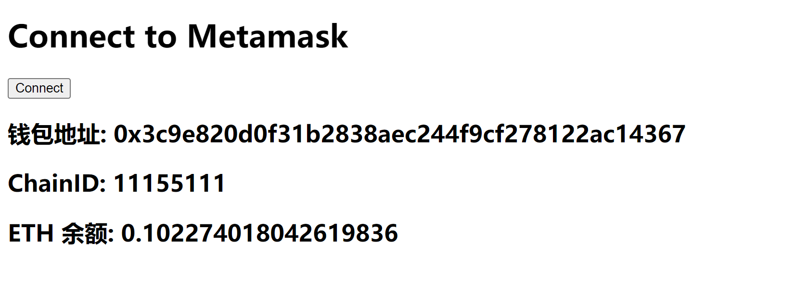

这一讲，我们将介绍如何通过 `ethers.js` 在网页上连接小狐狸钱包，读取账户地址，chainID，以及 `ETH` 余额。

## **Metamask**

Metamask（小狐狸）钱包是以太坊最受欢迎的开源钱包，它可以作为 PC 端的浏览器插件或移动端（安卓和苹果）的 APP 使用。

在使用 Metamask 开发前，你需要先下载它。记住：

**一定要在官网上下载:** **[https://metamask.io/download/](https://metamask.io/download/)**

很多多用户钱包被盗，就是下载了盗版的小狐狸钱包之后输入了助记词/私钥。

## **连接 metamask**

在安装好 metamask 钱包后，浏览器会给每个页面注入一个 `window.ethereum` 对象，用于和钱包交互。`ethers.js` 提供的 `BrowserProvider` 封装了一个标准的浏览器 Provider，直接在程序中生成一个 provider 对象，方便使用：

```javascript
// 获得provider
const provider = new ethers.BrowserProvider(window.ethereum)
```

之后就像 `ethers.js` 中的 `provider` 一样使用就好，下面举几个例子。

首先，我们先写一个简单的 HTML 页面，因为小狐狸钱包是浏览器插件，必须在浏览器中使用。

```html
<!DOCTYPE html>
<html lang="en">
  <head>
    <meta charset="UTF-8">
    <meta name="viewport" content="width=device-width, initial-scale=1.0">
  </head>
  <body>
    <h1 id="header">Connect to Metamask</h1>
    <button class="connect"> Connect</button>
    <h2>钱包地址: <span class="showAccount"></span></h2>
    <h2>ChainID: <span class="showChainID"></span></h2>
    <h2>ETH 余额: <span class="showETHBalance"></span></h2>
  </body>
</html>
```


然后我们写一些 `javascript` 脚本嵌入进去。

1. 引入 `ethers.js` 包，获取页面中的按钮和文本变量，给按钮加一个监听器，被点击时会触发 `onClickHandler()` 函数。

```javascript
import { ethers } from "https://cdnjs.cloudflare.com/ajax/libs/ethers/6.2.3/ethers.js";
const ethereumButton = document.querySelector('.connect');
const showAccount = document.querySelector('.showAccount');
const showChainID = document.querySelector('.showChainID');
const showETHBalance = document.querySelector('.showETHBalance');

ethereumButton.addEventListener(`click`, onClickHandler)
```

2. 接下来我们写 `onClickHandler()` 函数的内容，首先连接 metamask，创建 `provider` 变量。

```javascript
// 获得provider
const provider = new ethers.BrowserProvider(window.ethereum)
```

3. 获取并打印钱包地址：

```javascript
// 读取钱包地址
const accounts = await provider.send("eth_requestAccounts", []);
const account = accounts[0]
console.log(`钱包地址: ${account}`)
showAccount.innerHTML = account;
```

4. 获取并打印 ChainID：

```javascript
// 读取chainid
const { chainId } = await provider.getNetwork()
console.log(`chainid: ${chainId}`)
showChainID.innerHTML = chainId;
```

5. 读取并打印钱包的 `ETH` 余额：

```javascript
// 读取ETH余额
const signer = await provider.getSigner()
const balance = await provider.getBalance(signer.getAddress());
console.log(`以太坊余额： ${ethers.formatUnits(balance)}`)
showETHBalance.innerHTML = ethers.formatUnits(balance);
```



## **总结**

这一讲，我们介绍了如何利用 `ethers.js` 在网页中连接 metamask 钱包，读取账户地址，chainID，以及 `ETH` 余额。这是构建 DAPP 的基础。
